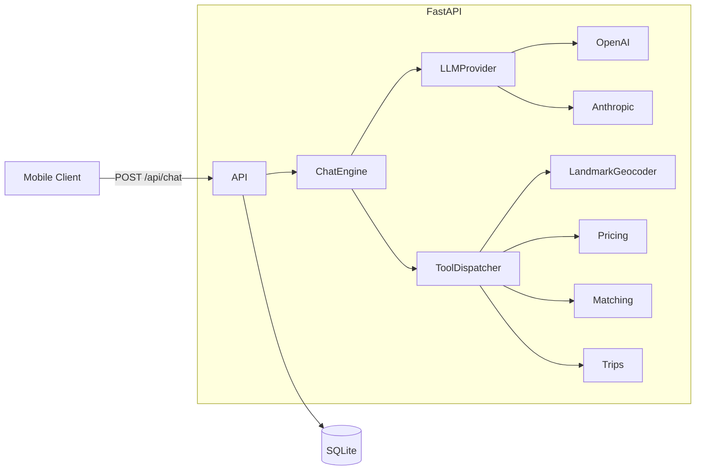

# Egyptian Arabic ride-hailing chatbot (backend)

FastAPI service that powers a conversational assistant for an Uber-like app in Egypt. It speaks **Egyptian Arabic (Masri)**, understands **local landmarks** (seeded JSON), runs **driver matching**, **dynamic pricing**, and manages the **full trip lifecycle** via LLM **tool/function calling**. Persistence is **SQLite**.

## Architecture



## Quick start

From this directory (`ride_chatbot/`):

```bash
python -m venv .venv
.venv\Scripts\activate   # Windows
# source .venv/bin/activate  # macOS/Linux

pip install -e ".[dev]"
copy .env.example .env   # Windows: copy; set OPENAI_API_KEY
```

Run the API:

```bash
uvicorn app.main:app --reload
```

Health check:

```bash
curl http://127.0.0.1:8000/healthz
```

### Example Masri chat (`curl`)

```bash
curl -s -X POST http://127.0.0.1:8000/api/chat ^
  -H "Content-Type: application/json" ^
  -d "{\"user_id\":\"u_demo\",\"message\":\"عايز عربية اقتصادي من المعادي للتجمع الخامس\"}"
```

Trip details (after you know `trip_id` from tool logs or DB):

```bash
curl "http://127.0.0.1:8000/api/trips/1?user_id=u_demo"
```

Drivers near a point (debug):

```bash
curl "http://127.0.0.1:8000/api/drivers?near=30.0444,31.2357&vehicle_type=economy&limit=3"
```

## Environment variables

| Variable | Description |
|----------|-------------|
| `LLM_PROVIDER` | `openai` (default), `anthropic`, or `mock` (tests / no key). |
| `OPENAI_API_KEY` | Required when `LLM_PROVIDER=openai`. |
| `OPENAI_MODEL` | Default `gpt-4o-mini`. |
| `ANTHROPIC_API_KEY` | Required when `LLM_PROVIDER=anthropic`. |
| `ANTHROPIC_MODEL` | Default `claude-sonnet-4-20250514`. |
| `DATABASE_URL` | Default `sqlite+aiosqlite:///./ride_chatbot.db`. |

### Switching LLM provider

- **OpenAI**: `LLM_PROVIDER=openai` + `OPENAI_API_KEY`.
- **Anthropic**: `LLM_PROVIDER=anthropic` + `ANTHROPIC_API_KEY`.
- **Mock** (no network): `LLM_PROVIDER=mock` — the model returns an empty reply unless you override the FastAPI dependency in tests.

## LLM tools (function calling)

The assistant must call tools instead of inventing facts:

| Tool | Purpose |
|------|---------|
| `resolve_location` | Landmark / area → `{lat,lng,name_ar,...}`. |
| `list_vehicle_types` | Economy / Comfort / XL / Scooter fare knobs. |
| `estimate_price` | EGP **min–max** band, surge, distance, ETA. |
| `find_drivers` | Top drivers by proximity, rating, acceptance. |
| `book_trip` | Creates trip, assigns driver, starts lifecycle. |
| `get_trip_status` | Status, ETA, price band, driver snippet. |
| `modify_trip` | Change dropoff and/or vehicle type (pre-pickup). |
| `cancel_trip` | Cancellation + possible small fee if driver en route. |
| `rate_driver` | Post-trip 1–5 stars. |

## Data files

- [`data/landmarks.json`](data/landmarks.json) — ~60 Egyptian landmarks (Arabic + English + aliases + coordinates).
- [`data/drivers_seed.json`](data/drivers_seed.json) — ~30 seeded drivers.
- [`data/vehicles.json`](data/vehicles.json) — vehicle tiers and EGP pricing parameters.

Seeding is **idempotent** (only fills empty tables).

## Tests

```bash
cd ride_chatbot
set LLM_PROVIDER=mock
python -m pytest -v
```

`tests/conftest.py` sets a temporary SQLite file and `LLM_PROVIDER=mock` before importing the app.

## Production notes (out of scope here)

- Swap `LandmarkGeocoder` for **Google Places / Mapbox**.
- Add **JWT auth** instead of trusting `user_id` from the client.
- Add **payments** (e.g. Fawry / card) and **push notifications**.

## License

MIT (adjust as needed for your product).
